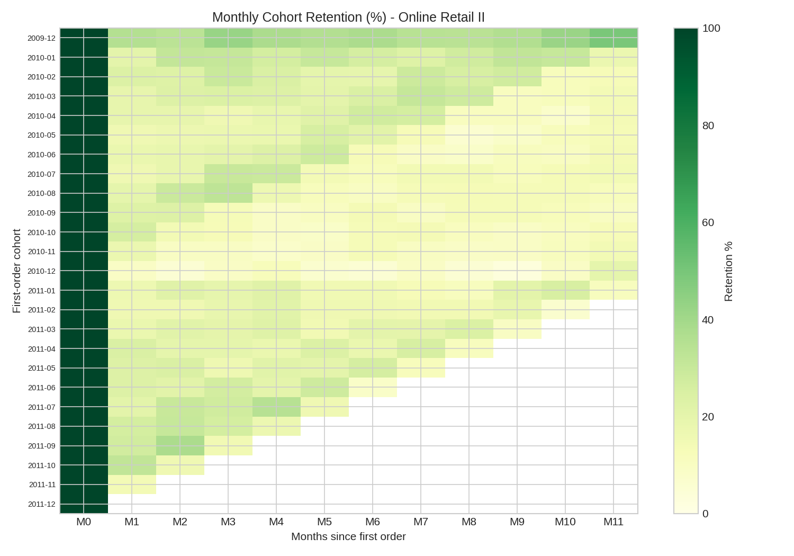
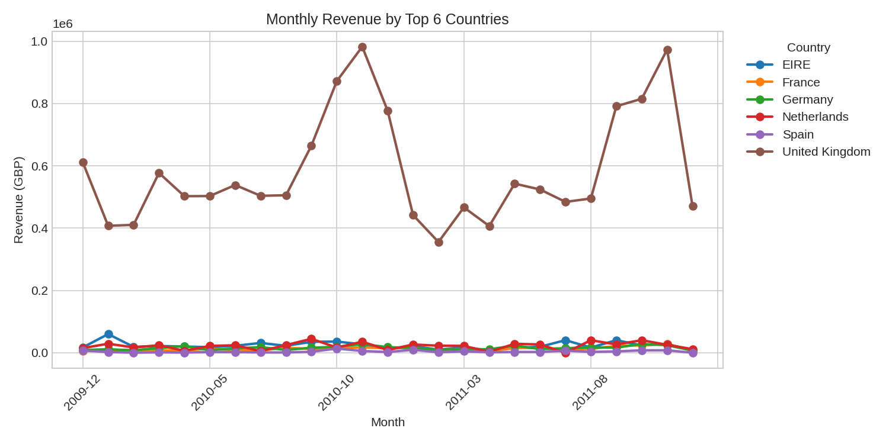
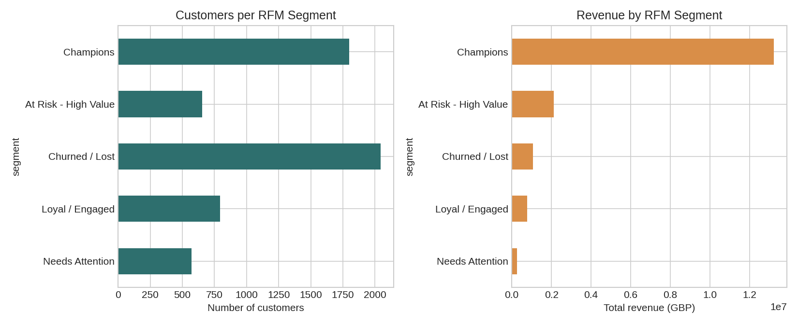
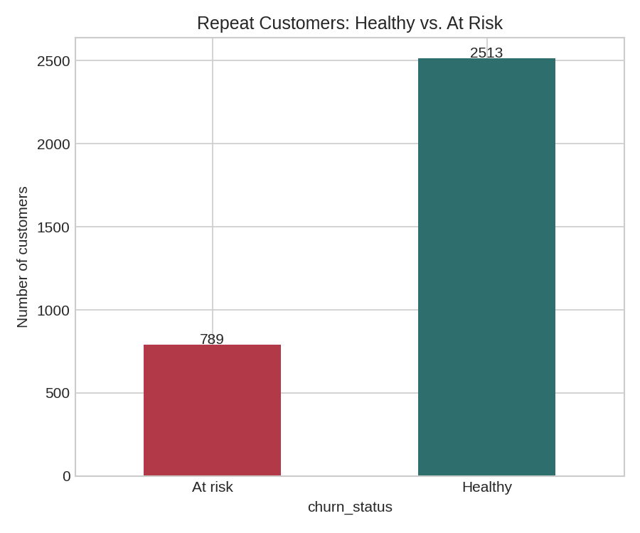

# Retail Analytics Portfolio Project — Online Retail II

A SQL + Python analytics project demonstrating core junior data analyst
skills — writing and optimizing SQL over a Postgres-style schema, building
BI dashboards, running cohort retention analysis, and turning transactional
data into business insight — applied to a **real, public dataset** of
~1 million e-commerce transactions.

## Why this project

It's built to demonstrate the kind of work a junior data analyst role
typically asks for:
- Writing and optimizing **SQL** against a **PostgreSQL**-style data
  warehouse to analyze **usage volume and customer retention**
- Designing and maintaining **BI dashboards** to track KPIs
- Helping keep **data pipelines clean and trustworthy**
- Bridging **technical and commercial** thinking for stakeholders across
  teams

This repo has a concrete artifact for each of those, built on real data
rather than a toy example.

## The dataset

**Online Retail II** (UCI Machine Learning Repository / Kaggle) — every
transaction from a UK-based online gift retailer, 01/12/2009 to 09/12/2011,
~1.07M raw line items across 41 countries. See [`data/README.md`](data/README.md)
for the source, license, and full cleaning methodology.

~25% of the raw rows (cancellations, missing customer IDs, invalid
quantities/prices, non-product codes) were cleaned out before analysis —
this cleaning step is itself part of the deliverable, not an afterthought.

## Repo structure

```
├── data/
│   ├── README.md                # data source, license, cleaning notes
│   ├── clean_data.py             # raw CSV -> analysis-ready tables
│   └── processed/
│       ├── customers.csv
│       ├── orders.csv
│       ├── top_products.csv
│       └── order_line_items_sample.csv
├── sql/
│   ├── schema.sql                # PostgreSQL DDL
│   └── queries/
│       ├── 01_monthly_retention_cohorts.sql
│       ├── 02_order_volume_trends.sql
│       ├── 03_rfm_customer_segmentation.sql
│       ├── 04_churn_and_at_risk_customers.sql
│       └── 05_top_products_and_countries.sql
├── analysis/
│   ├── run_analysis.py           # computes metrics + saves chart PNGs
│   └── build_dashboard.py         # builds the interactive dashboard.html
├── images/                        # chart exports (embedded below)
├── dashboard.html                  # interactive dashboard (open in browser)
└── README.md
```

## Tech stack

`PostgreSQL` (schema + queries) · `Python` (`pandas`, `matplotlib`, `plotly`)
· Git/GitHub

*(AWS QuickSight itself requires a live AWS account to host, so the
dashboard here is built with Plotly as a portable stand-in using the same
KPI definitions and chart types.)*

## Key insights

- **Retention drops off fast, then partially recovers**: month-1 retention
  across cohorts ranges roughly 9%–35%, with the earliest (Dec 2009) cohort
  retaining noticeably better than later ones — consistent with a
  wholesaler-heavy customer base where a subset of B2B buyers reorder
  regularly while most one-time buyers don't return.
- **Revenue is heavily concentrated**: RFM segmentation shows "Champions"
  (~31% of customers) drive roughly 76% of total revenue — a small,
  identifiable group worth prioritizing for retention efforts.
- **789 repeat customers are "at risk"** (gone quiet well past their usual
  reorder gap), representing about £2.4M of historical revenue — a
  concrete, actionable list for a win-back campaign.
- **Revenue is UK-dominated** but has a long tail across 40 other
  countries, useful for prioritizing international support/marketing.

Run `python analysis/run_analysis.py` to reproduce these numbers exactly.

## Dashboards

### Monthly cohort retention


### Revenue by country


### RFM customer segmentation


### Churn risk among repeat customers


An interactive version of the top-level KPIs (with hover tooltips) is in
[`dashboard.html`](dashboard.html) — download it and open in any browser,
or view it via [htmlpreview.github.io](https://htmlpreview.github.io/) by
pasting in this file's raw GitHub URL.

## SQL highlights

The RFM (Recency, Frequency, Monetary) customer segmentation query —
a standard technique for turning transaction history into an actionable
customer list for marketing/retention teams:

```sql
WITH rfm_base AS (
    SELECT
        customer_id, country,
        (SELECT MAX(order_date) FROM orders) - MAX(order_date) AS recency_days,
        COUNT(*)          AS frequency,
        SUM(order_value)  AS monetary
    FROM orders
    GROUP BY customer_id, country
),
rfm_scored AS (
    SELECT *,
        NTILE(4) OVER (ORDER BY recency_days DESC) AS r_score,
        NTILE(4) OVER (ORDER BY frequency ASC)      AS f_score,
        NTILE(4) OVER (ORDER BY monetary ASC)       AS m_score
    FROM rfm_base
)
SELECT *,
    CASE
        WHEN r_score >= 3 AND f_score >= 3 AND m_score >= 3 THEN 'Champions'
        WHEN r_score <= 2 AND f_score <= 2                  THEN 'Churned / Lost'
        ELSE 'Needs Attention'
    END AS segment
FROM rfm_scored;
```

See [`sql/queries/`](sql/queries) for the full set, including cohort
retention, order volume trends, and churn/at-risk detection.

## How to run this locally

```bash
git clone https://github.com/<your-username>/<your-repo-name>.git
cd <your-repo-name>
pip install -r requirements.txt

# Optional: regenerate data/processed/ from the raw Kaggle CSV
#   1. Download online_retail_II.csv from:
#      https://www.kaggle.com/datasets/mashlyn/online-retail-ii-uci
#   2. Save it as data/online_retail_II_raw.csv
#   3. python data/clean_data.py

python analysis/run_analysis.py     # recompute metrics + regenerate chart PNGs
python analysis/build_dashboard.py  # rebuild dashboard.html
```

To run the SQL against a real PostgreSQL instance:

```bash
createdb retail_portfolio
psql retail_portfolio -f sql/schema.sql
psql retail_portfolio -c "\copy customers FROM 'data/processed/customers.csv' CSV HEADER"
psql retail_portfolio -c "\copy orders FROM 'data/processed/orders.csv' CSV HEADER"
psql retail_portfolio -c "\copy top_products FROM 'data/processed/top_products.csv' CSV HEADER"
psql retail_portfolio -f sql/queries/01_monthly_retention_cohorts.sql
```

## About

A portfolio project using a real public transactional dataset to
demonstrate SQL, data cleaning, BI dashboarding, and business-facing
analysis (cohort retention, RFM segmentation, churn risk).
